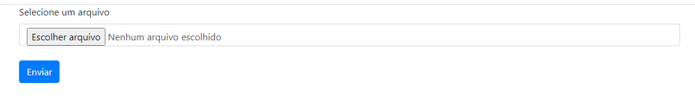

#  Upload Arquivo com Multer

Nessa mini projeto, fiz um formulário para upload de arquivos. Usando a dependencia `MULTER` e `EXPREESS`.

`Multer` é um `middleware node.js` para manipulação `multipart/form-data`, que é usado principalmente para fazer upload de arquivos.

Foi desenvolvido em `typeScript` e  `HTML-5`.

### Criando projeto

`npm init -y`

### Baixando os pacotes de dependêcias
`npm install express multer --save`
`npm install typescript @types/express @types/multer --save-dev`
`npm install copyfiles --save-dev`

### Dependência.

```
  "dependencies": {
    "express": "^4.18.1",
    "multer": "^1.4.5-lts.1"
  }
```
### Dependência de Desenvolvimento.

```
  "devDependencies": {
    "@types/express": "^4.17.13",
    "@types/multer": "^1.4.7",
    "copyfiles": "^2.4.1",
    "typescript": "^4.8.2"
  }
```

### Configuração do arquivo `package.json`
```
    "scripts": {
    "prestart": "tsc && copyfiles *.html dist/",
    "start": "node dist/index.js"
    }
```

# ScreenShot

## --
<p align="center">

</p>


<h1 align="center">💻 Desenvolvido Por: Gilberto Júnior</h1>